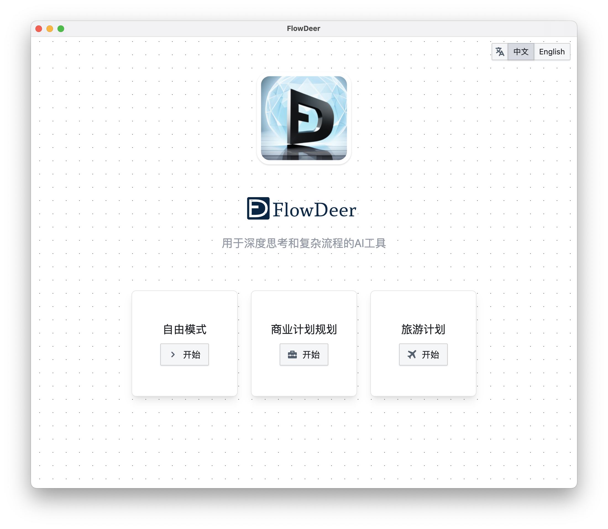

# FlowDeer - AI tools for complex workflows and deep thoughts

[简体中文](README.md) | [English](README_EN.md)

> 本仓库用于FlowDeer在线版的hosting，独立部署版、客户端的下载和客服

## 内测交流群·微信

## 功能简介

https://github.com/easychen/flowdeer-dist/assets/1294760/304491c6-bf2f-4dc3-aecb-1435e934aad5

## 使用教程

[Youtube](https://youtu.be/vz1xBKzLAVM)  | [B站](https://www.bilibili.com/video/BV1xP411Y7ak/)

## 在线版

可访问 [f.ai0c.com](https://f.ai0c.com) 使用，该站点部署在GitHub，如果访问较慢，可以下载独立部署版执行部署。

## 客户端

内测完成后提供，将支持
- Windows ( 64位，win7以上系统 )
- Mac( intel / arm 架构 )

## 独立部署版

### 一键部署到 Vercel

### 部署到任意host

1. 下载本仓库代码
1. [docs](./docs/) 目录下为即为独立部署版代码，可复制到支持静态网页的服务器、或者对象存储
1. 注意服务器需要支持 WASM 文件。
