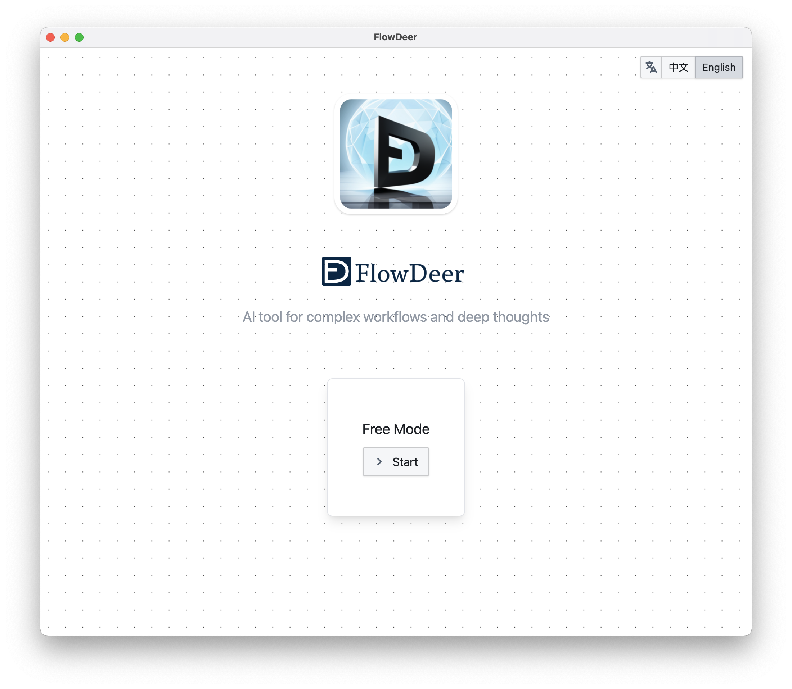

# FlowDeer - AI tools for complex workflows and deep thoughts

[简体中文](README.md) | [English](README_EN.md)

> This repository is used for hosting the online version of FlowDeer, as well as providing downloads and customer support for the standalone deployment version and client.

## Feature

https://github.com/easychen/flowdeer-dist/assets/1294760/304491c6-bf2f-4dc3-aecb-1435e934aad5

## User Tutorial

[Youtube](https://youtu.be/vz1xBKzLAVM)  | [Bilibili](https://www.bilibili.com/video/BV1xP411Y7ak/)

## Online Version

You can access [f.ai0c.com](https://f.ai0c.com) to use it. This site is deployed on GitHub. If the access is slow, you can download the standalone deployment version and execute the deployment.

## Client

It will be available after the internal testing is completed, and it will support:
- Windows (64-bit, Windows 7 and above)
- Mac (Intel / ARM architecture)

## Standalone Deployment Version

### One-click deployment to Vercel

### Deployment to any host

1. Download the code from this repository.
1. The [docs](./docs/) directory contains the code for the standalone deployment version, which can be copied to a server that supports static web pages or object storage.
1. The server need to support WASM files.
